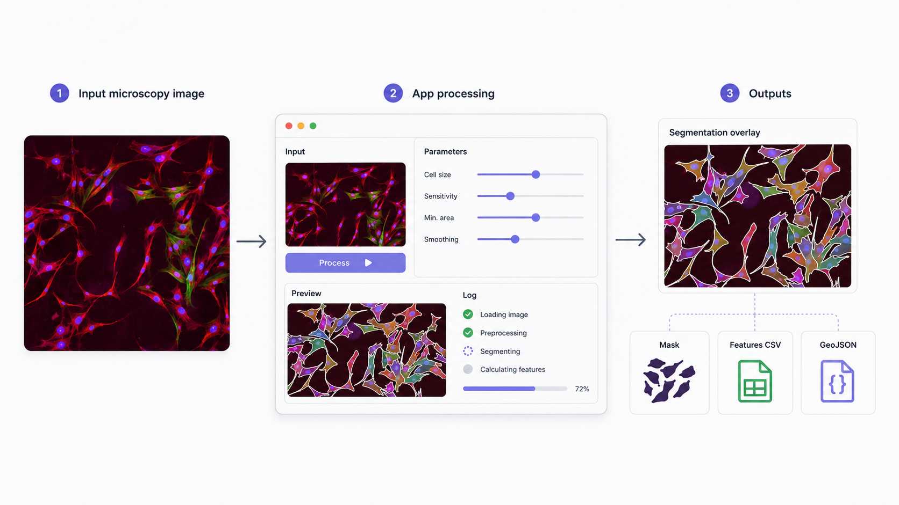
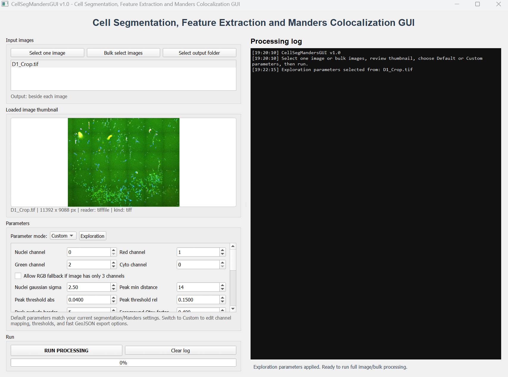
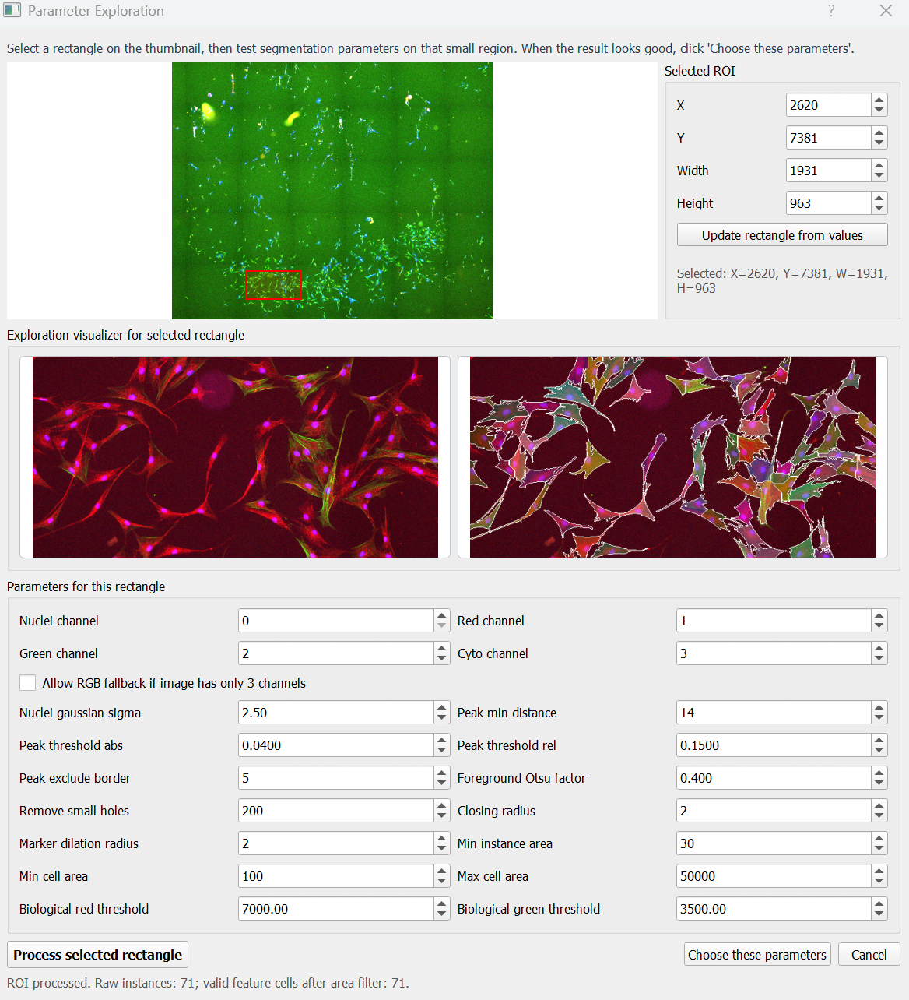
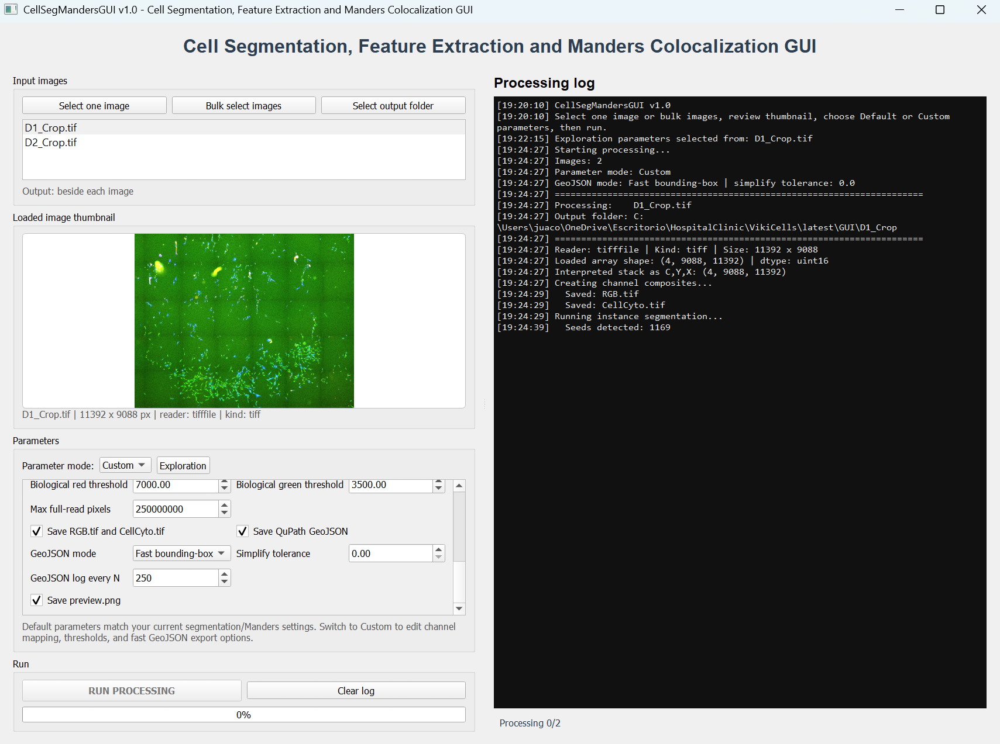
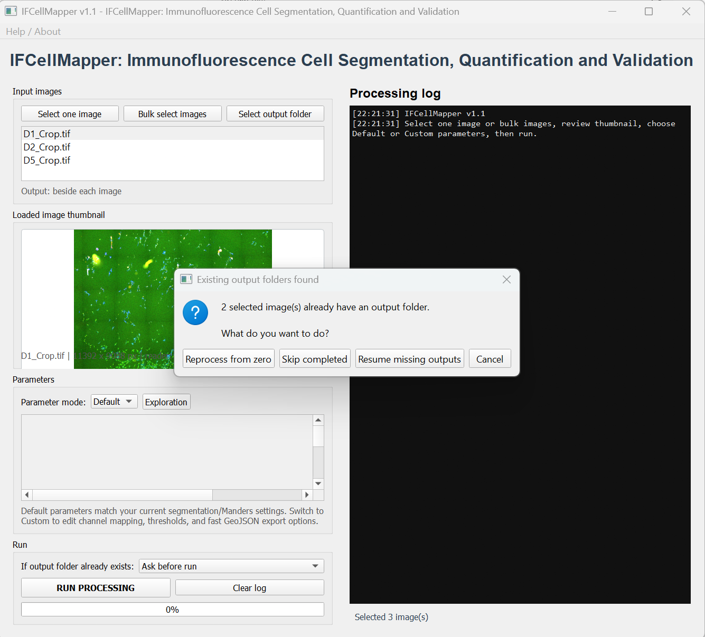
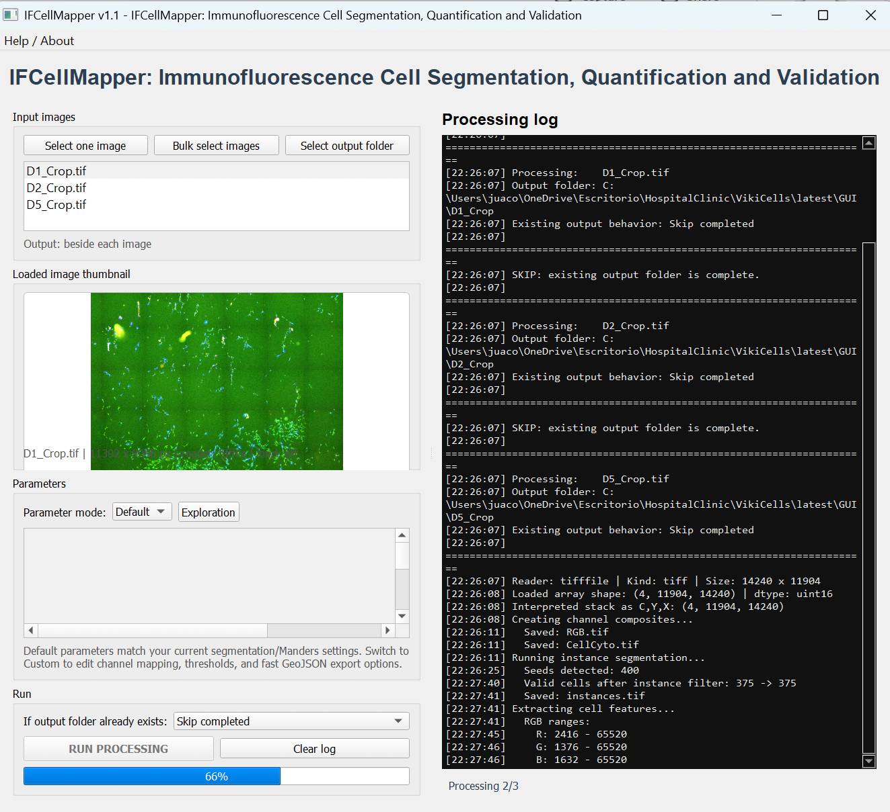
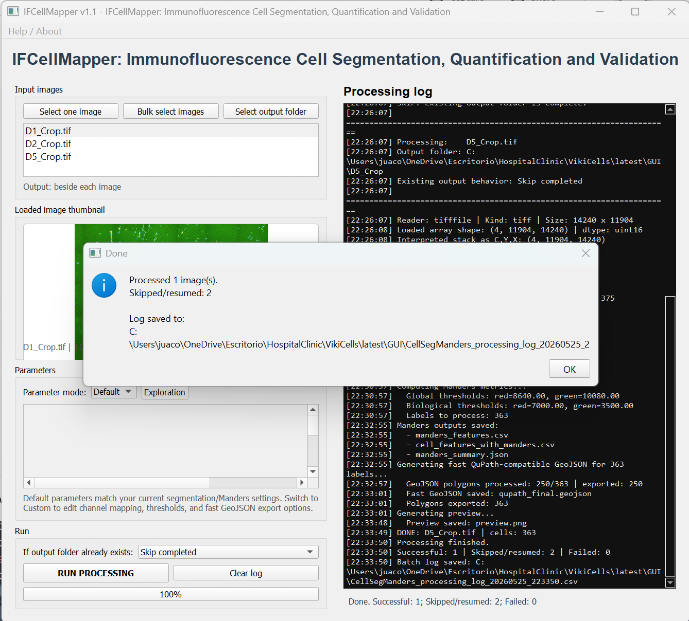

# Cell Well Segmentation

[](https://doi.org/10.5281/zenodo.20387083)
[](LICENSE)
[](pyproject.toml)

**Cell Well Segmentation** is a Python/PyQt5 desktop application for immunofluorescence cell segmentation, per-cell feature extraction, Manders colocalization analysis, QuPath-compatible GeoJSON export, and optional DICE/IoU validation using ground-truth GeoJSON annotations.

The app is designed for microscopy and digital pathology workflows where images may be large, multichannel, and metadata-sensitive.

<p align="center">
  
</p>

## Main features

- GUI-based single-image and bulk-image processing.
- Multichannel TIFF/OME-TIFF support through `tifffile`.
- WSI-style format support through OpenSlide when available, including SVS, NDPI, MRXS, SCN, VMS/VMU, BIF, SVSLIDE, and DICOM-like slide files.
- RGB fallback for standard PNG/JPEG/RGB images.
- ROI-based parameter exploration before full-image processing, with optional ROI DICE/IoU validation using a full-image GeoJSON ground truth.
- Instance segmentation using nuclei seeding and watershed over cytoplasmic foreground.
- Per-cell measurements exported to CSV, including biological positivity flags for red, green, and double-positive cells.
- Manders colocalization metrics exported per cell and as summary JSON.
- QuPath-compatible GeoJSON export.
- Fast bounding-box GeoJSON export mode for improved performance on large images.
- Resume/skip options for previously processed output folders.
- Optional DICE/IoU validation against GeoJSON ground truth during full processing and ROI-based parameter tuning.

## Graphical interface

The main interface allows users to select one image or multiple images, define an output folder, inspect the loaded image thumbnail, select default or custom parameters, and run the segmentation workflow.

<p align="center">
  
</p>

## Parameter exploration

Before full-image processing, users can test segmentation settings on a selected region of interest. This helps tune channel mapping, nuclei detection, foreground thresholding, morphology filters, and cell-size filters before applying the parameters to large images or batch datasets.

ROI validation can also be enabled in the Parameter Exploration window. The user can select a full-image ground-truth GeoJSON file from QuPath, and the application rasterizes only the selected ROI coordinates to calculate DICE, IoU, precision, and recall for the current parameter set. This allows practical parameter tuning without manually creating a separate ROI-level GeoJSON file.

<p align="center">
  
</p>

## Batch processing

Cell Well Segmentation supports bulk image processing. The processing log reports the current image, detected reader, image dimensions, interpreted channel stack, detected seeds, valid cell count, extracted features, Manders metrics, GeoJSON export progress, and preview generation.

<p align="center">
  
</p>

## Existing output handling

When output folders already exist, the application lets the user decide whether to reprocess from zero, skip completed images, resume missing outputs, or cancel the run.

<p align="center">
  
</p>

Completed or partially completed outputs can be skipped or resumed. This is useful for long batch runs where some images were already processed.

<p align="center">
  
</p>

## Finished run

At the end of processing, the application summarizes successful, skipped/resumed, and failed images. A batch processing log is saved as a CSV file.

<p align="center">
  
</p>

## Expected input

The default channel mapping is:

| Parameter | Default channel index | Purpose |
|---|---:|---|
| Nuclei channel | 0 | Nuclei / seed detection |
| Red channel | 1 | Red biological signal |
| Green channel | 2 | Green biological signal |
| Cyto channel | 3 | Cytoplasmic / foreground segmentation signal |

Use **Custom** parameters if your images have a different channel order.

## Main outputs

For every processed image, the app creates one output folder named after the image stem. Main files include:

| Output | Description |
|---|---|
| `instances.tif` | Labeled instance mask; each segmented cell has a unique integer label. |
| `cell_features.csv` | Per-cell morphology, intensity, and biological positivity flags. |
| `manders_features.csv` | Per-cell Manders colocalization metrics and positivity flags. |
| `cell_features_with_manders.csv` | Combined features, positivity flags, and Manders metrics. |
| `manders_summary.json` | Summary thresholds, positivity counts, and processing metadata for Manders analysis. |
| `RGB.tif` | RGB composite from selected channels. |
| `CellCyto.tif` | Composite used for segmentation preview/processing. |
| `qupath_final.geojson` | QuPath-compatible segmentation polygons. |
| `preview.png` | Visual QC summary. |
| `validation/dice_report.csv` | Optional full-image validation report when ground-truth GeoJSON is provided. |

## Cell-level features

The file `cell_features.csv` contains one row per retained segmented cell after the area filter. The current feature table includes:

| Feature group | Columns | Description |
|---|---|---|
| Identity | `label` | Unique integer label from `instances.tif`. |
| Morphology | `area_px`, `perimeter_px` | Basic shape measurements in pixels. |
| Position | `centroid_y`, `centroid_x` | Cell centroid coordinates in image pixel space. |
| Red intensity | `red_max`, `red_mean`, `red_median`, `red_std`, `red_p25`, `red_p75`, `red_cv`, `red_total` | Per-cell red-channel intensity summary. |
| Green intensity | `green_max`, `green_mean`, `green_median`, `green_std`, `green_p25`, `green_p75`, `green_cv`, `green_total` | Per-cell green-channel intensity summary. |
| Blue intensity | `blue_max`, `blue_mean`, `blue_median`, `blue_std`, `blue_p25`, `blue_p75`, `blue_cv`, `blue_total` | Per-cell blue/nuclear-channel intensity summary. |
| Segmentation intensity | `seg_intensity` | Currently equal to `green_mean`, kept as a convenient segmentation-related intensity column. |
| Biological positivity | `red_positive`, `green_positive`, `double_positive` | Boolean flags based on the user-defined biological red and green thresholds. |

The biological thresholds do **not** change the segmentation mask and do **not** remove cells from `cell_features.csv`. They only add interpretable Boolean annotations:

```text
red_positive    = red_mean >= biological_red_threshold
green_positive  = green_mean >= biological_green_threshold
double_positive = red_positive AND green_positive
```

## Manders colocalization outputs

Manders analysis is calculated per cell using red and green channel intensities inside each segmented cell mask. The app reports three thresholding strategies:

| Strategy | Description |
|---|---|
| Global Otsu | Uses one Otsu threshold for the full red channel and one for the full green channel. |
| Per-cell Otsu | Calculates Otsu thresholds separately inside each cell. |
| Biological thresholds | Uses the user-defined biological red and green thresholds. |

The file `manders_features.csv` includes, for each processed cell:

| Column group | Description |
|---|---|
| `manders_global_red_in_green`, `manders_global_green_in_red` | Manders coefficients using global Otsu thresholds. |
| `manders_cellotsu_red_in_green`, `manders_cellotsu_green_in_red` | Manders coefficients using per-cell Otsu thresholds. |
| `manders_biological_red_in_green`, `manders_biological_green_in_red` | Manders coefficients using biological red/green thresholds. |
| `*_overlap_fraction_pixels` | Fraction of pixels positive in both channels under the corresponding strategy. |
| `*_red_positive_fraction`, `*_green_positive_fraction` | Fraction of pixels positive for each channel under the corresponding strategy. |
| `red_positive`, `green_positive`, `double_positive` | Cell-level Boolean positivity flags based on mean red/green intensity. |

`cell_features_with_manders.csv` merges the general feature table with Manders metrics using the cell label. `manders_summary.json` stores the global thresholds, biological thresholds, and counts of red-positive, green-positive, and double-positive cells.

## DICE and validation

Cell Well Segmentation supports two validation modes:

1. **Full-image validation during processing**: the predicted binary cell mask (`instances.tif > 0`) is compared with a selected or matched ground-truth GeoJSON. Results are saved under `validation/`.
2. **ROI validation during Parameter Exploration**: the user selects a full-image ground-truth GeoJSON, selects a ROI in the exploration window, and the app rasterizes only the ROI portion of the GeoJSON to calculate DICE/IoU for the current parameters.

The validation report includes:

| Metric | Meaning |
|---|---|
| `dice_pixel` | Pixel-level Sørensen-Dice overlap between predicted mask and ground truth. |
| `iou_pixel` | Pixel-level intersection-over-union. |
| `precision_pixel` | Fraction of predicted pixels that overlap ground truth. |
| `recall_pixel` | Fraction of ground-truth pixels recovered by the prediction. |
| `object_precision`, `object_recall`, `object_f1` | Approximate object-level metrics using connected GT objects and predicted instance labels. |

For correct validation, the GeoJSON must come from the same image, same resolution, and same coordinate system as the image loaded in the app.

## Installation from source

```bash
git clone https://github.com/Juaco2r/cell-well-segmentation.git
cd cell-well-segmentation
python -m venv .venv
.venv\Scripts\activate  # Windows
pip install -r requirements.txt
python -m cell_well_segmentation
```

On macOS/Linux:

```bash
python -m venv .venv
source .venv/bin/activate
pip install -r requirements.txt
python -m cell_well_segmentation
```

## OpenSlide support

For WSI formats such as SVS and NDPI, install OpenSlide support:

```bash
pip install openslide-python openslide-bin
```

If OpenSlide is unavailable, TIFF/OME-TIFF and standard raster images can still work through `tifffile` and Pillow.

## Windows executable build

Install development dependencies and run the packaging helper:

```bash
pip install -r requirements.txt
pip install pyinstaller
packaging\build_windows.bat
```

The executable will be created under `dist/`.

## Recommended repository structure

```text
cell-well-segmentation/
├─ src/cell_well_segmentation/
│  ├─ __init__.py
│  ├─ __main__.py
│  └─ app.py
├─ assets/icons/
├─ assets/screenshoots/
├─ docs/
│  └─ zenodo_release_checklist.md
├─ packaging/
│  ├─ CellWellSegmentation.spec
│  └─ build_windows.bat
├─ .github/workflows/python-check.yml
├─ .gitignore
├─ CITATION.cff
├─ LICENSE
├─ README.md
├─ requirements.txt
├─ pyproject.toml
├─ CHANGELOG.md
├─ CONTRIBUTING.md
└─ .zenodo.json
```

## Citation

If you use **Cell Well Segmentation**, please cite:

> Rodriguez Rojas JJ. Cell Well Segmentation: Immunofluorescence Cell Segmentation, Quantification and Validation. Version 1.0.0. Zenodo. 2026. doi: 10.5281/zenodo.20387083.

DOI: [10.5281/zenodo.20387083](https://doi.org/10.5281/zenodo.20387083)

## License

This project is released under the MIT License. See `LICENSE`.

## Author

José J. Rodriguez Rojas  
PhD Candidate, Universitat de Barcelona
